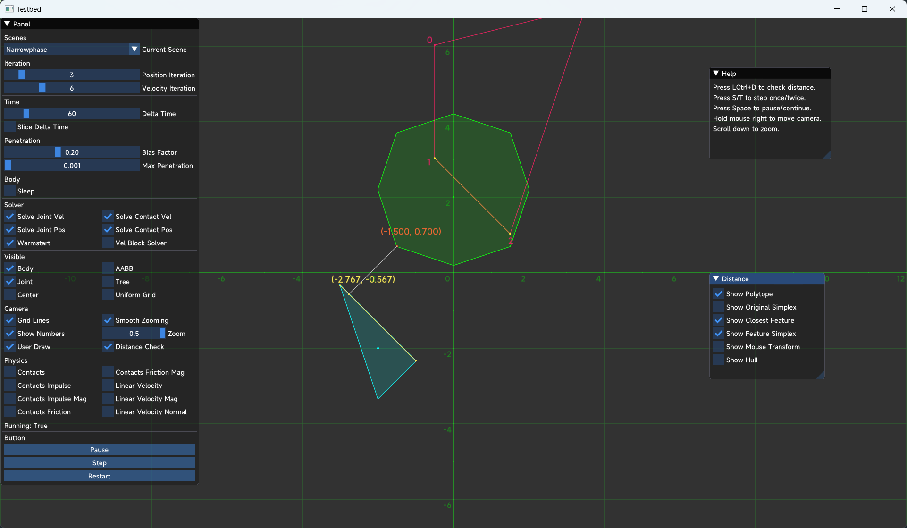
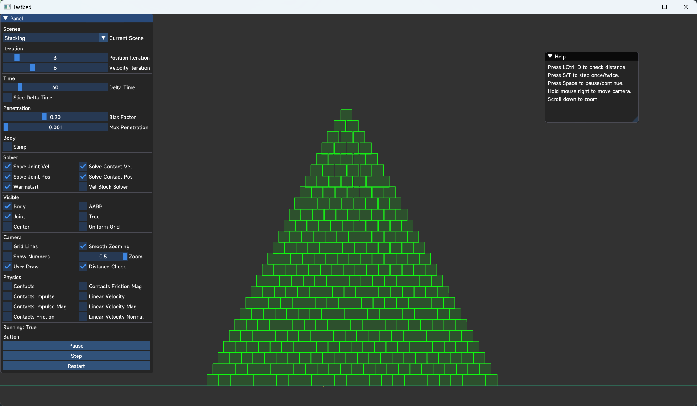
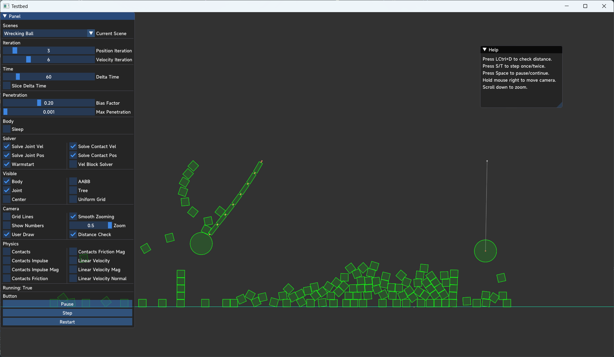
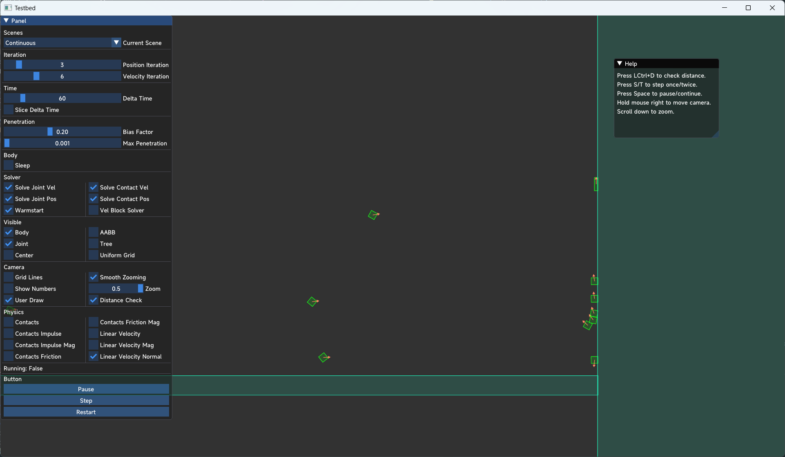

# Physics2D-TestBed-SFML

The Testbed of Physics2D, using SFML and ImGui.

# Build

```
cmake CMakeLists.txt
```

# Requirement

- C++ 20
- SFML
- ImGui-SFML
- ImGui

# Features

- Basic GUI
- Basic Debug Drawing
  - Rigid Body
  - AABB
  - DBVH
  - Joint
- Basic 2D Camera
  - Zooming
  - Smooth Transition
  - Tracing Specified Body

# Screenshot









