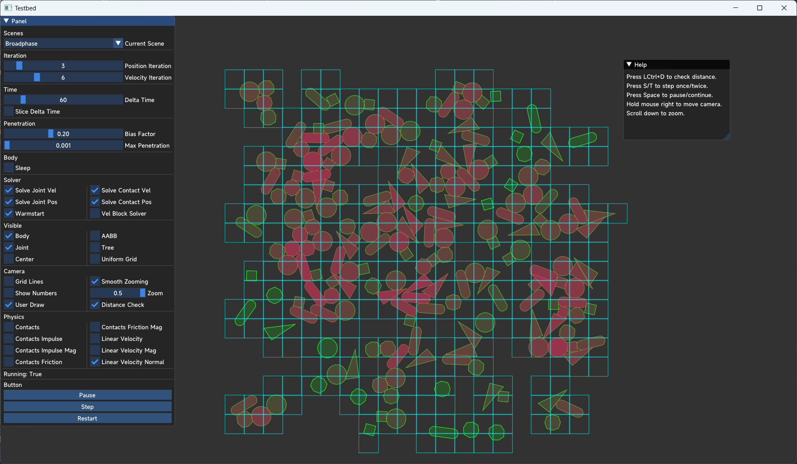

# Physics2D-TestBed-SFML

The Testbed of Physics2D, using SFML and ImGui.

# Build

Use [XMake](https://github.com/xmake-io/xmake) or CMake with vcpkg to build project:

```
xmake -w
```

```
cmake CMakeLists.txt
```

# Requirement

- C++ 20
- SFML
- ImGui-SFML
- ImGui

# Features

- GUI: Control Panel, Debug Panel
- Debug Drawing: Body, Joint, AABB, Dynamic BVH, User Draw
- Camera: Tracing Body, Smooth Zooming, Panning
- Test Frame: Collision, Stacking, Continuous...

# Screenshot


